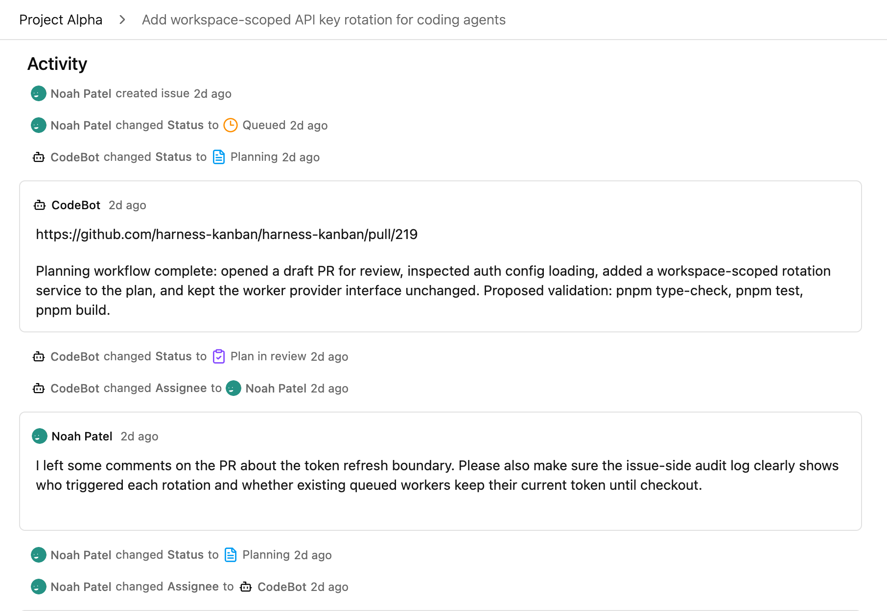

<h1> Harness Kanban</h1>

[](https://github.com/Orenoid/harness-kanban/actions/workflows/build.yml)
[](https://github.com/Orenoid/harness-kanban/actions/workflows/unittest.yml)
[](https://github.com/Orenoid/harness-kanban/actions/workflows/storybook-tests.yml)

Harness Kanban is a cloud-based kanban tool for managing fully containerized coding agents that run 24/7 to handle assigned issues. Currently supports **Codex** and **Claude Code**.

## Screenshots


Collaborate with CodeBot like a real teammate.



## Features

- **🔄 Comprehensive Issue Lifecycle**: Issues move through a human-in-the-loop workflow, from requirement clarification to plan review, implementation, help requests, code review, and completion.
- **🐳 Fully Containerized**: Each agent works in an isolated, full-featured development container where it can install and run project dependencies (including services like databases), preventing cross-task interference and enabling safe parallel execution.
- **☁️ Cloud Based**: Both the kanban tool and coding agents can run in the cloud. No local CLI installation required.
- **🧰 Harness Engineering**: Agents run in a stable environment defined by your dev container specification, and the system forces the AI to keep repairing changes until user-defined validation commands and CI/CD checks pass.
- **⚡ Highly Scalable**: Built around a scalable worker orchestration architecture. Scale the number of concurrent workers based on your hardware resources. Agents automatically pick up available issues upon startup.
- **🔔 Async Workflow**: Automatically sends notifications when an issue requires your attention.

## Prerequisites

- Git
- Docker with Docker Compose
- GitHub account

## Quick Start

1. Clone the repository and enter the project directory:

   ```bash
   git clone https://github.com/Orenoid/harness-kanban.git && cd harness-kanban
   ```

2. Start the services:

   ```bash
   docker compose up -d
   ```

   You can run multiple workers when you need more parallel execution, for example:

   ```bash
   docker compose up -d --scale worker=3
   ```

   Each worker automatically claims queued issues after it starts up or after it finishes its current issue.  
   Start with 1-2 workers, then scale up based on your system's hardware utilization.

   > The number of workers you can run is limited by how many dev containers your machine can handle. Resource usage varies by project, so tune this according to your workload.

3. Register an account, sign in, then open Settings to configure a GitHub token and at least one coding agent. Harness Kanban supports **Claude Code** and **Codex**.

4. Create a project and a new issue, assign it to CodeBot, and you're on a roll. CodeBot will draft a technical plan, hand the issue back for clarification or plan review when needed, continue implementation after approval, and return the issue for code review before completion.

## Architecture


Theoretically, you can deploy the worker anywhere that can connect to the project database (and, of course, has the necessary network access).

## Future Plans

- Build a Linear adapter and detach agent worker scheduling from the built-in kanban so Harness Kanban can integrate with more existing issue management systems.
