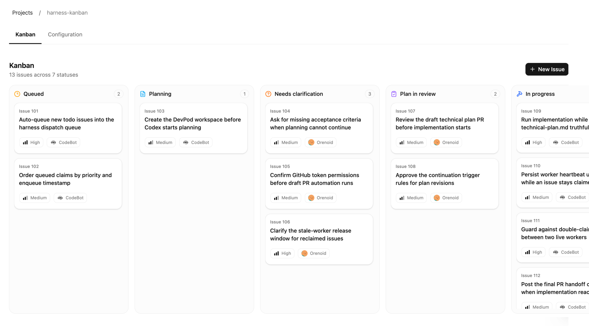
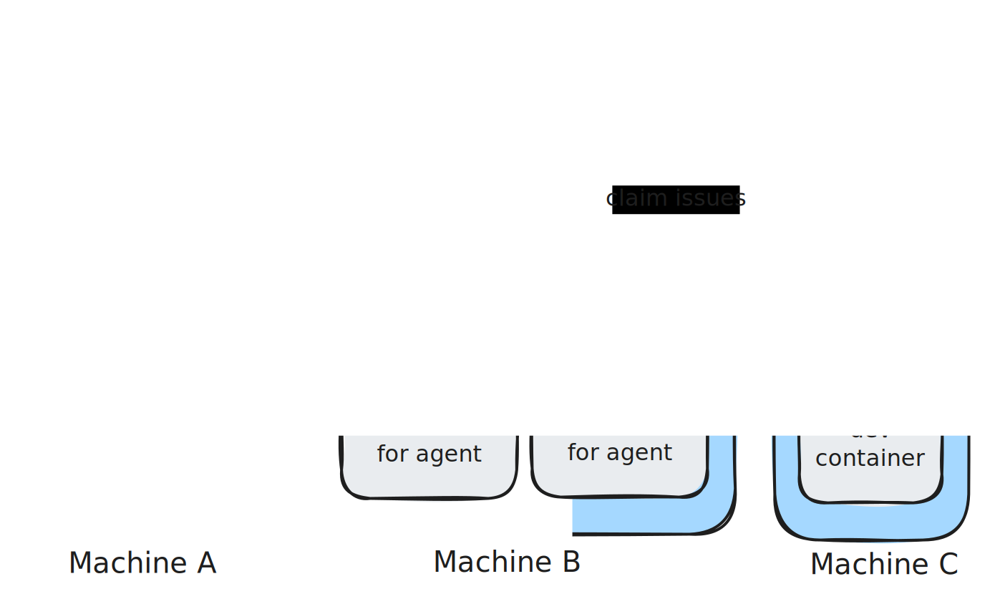

<h1> Harness Kanban</h1>

[](https://github.com/Orenoid/harness-kanban/actions/workflows/build.yml)
[](https://github.com/Orenoid/harness-kanban/actions/workflows/unittest.yml)
[](https://github.com/Orenoid/harness-kanban/actions/workflows/storybook-tests.yml)

> This project is still in the MVP stage. Many features still need refinement, and breaking changes may be introduced as the product evolves.

Harness Kanban is a cloud-based kanban tool for managing fully containerized coding agents that run 24/7 to handle assigned issues.

## Screenshots



## Features

- **🐳 Fully Containerized**: Coding agents develop in isolated containers, preventing cross-task interference and making parallel execution safer.
- **☁️ Cloud Based**: Both the kanban tool and coding agents can run in the cloud. No local CLI installation required.
- **⚡ Highly Scalable**: Built around a scalable worker orchestration architecture. Scale the number of concurrent coding agents based on your hardware resources. Agents automatically pick up available issues upon startup.
- **✅ Quality Assurance**: Automatically applies user-configured self-check instructions and CI/CD results, forcing the AI to fix errors until the code passes all checks.
- **👤 Human in the Loop**: Humans and agents alternate responsibility for different lifecycle stages of an issue.
- **🔔 Async Workflow**: Automatically sends notifications when an issue requires your attention.

Currently, Harness Kanban supports Codex only. Claude Code support is coming very soon.

## Prerequisites

- Git
- Docker with Docker Compose

## Deployment

First-time setup:

```bash
git clone https://github.com/Orenoid/harness-kanban.git
cd harness-kanban
cp apps/api-server/.env.example apps/api-server/.env
cp apps/web/.env.example apps/web/.env
cp apps/api-server/.env.worker.example apps/api-server/.env.worker
```

Start the stack:

```bash
docker compose up -d
```

## Architecture



Theoretically, you can deploy the worker anywhere that can connect to the project database (and, of course, has the necessary network access).

## Future Plans

1. Support more coding agents.
2. Implement more dynamic scheduling logic so that when an issue is blocked by a human step, such as waiting for review, workers can switch to other available issues.
3. Build a Linear adapter and detach agent worker scheduling from the built-in kanban so Harness Kanban can integrate with more existing issue management systems.
